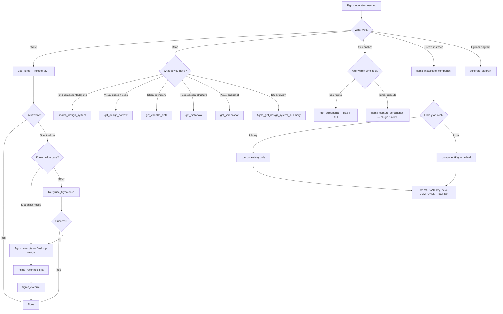

# Tool Selection Decision Tree

## Quick Reference

| I want to... | Use this tool |
|---|---|
| Create/edit nodes, components, variants | `use_figma` |
| Fix slot ghost nodes on existing instances | `figma_execute` |
| Find existing components before building | `search_design_system` |
| Get visual specs for a frame | `get_design_context` |
| Get token/variable values | `get_variable_defs` |
| Understand file structure | `get_metadata` |
| Verify visual result after remote write | `get_screenshot` |
| Verify visual result after desktop write | `figma_capture_screenshot` |
| Create a component instance | `figma_instantiate_component` |
| Create a FigJam diagram | `generate_diagram` |
| Check what user selected | `figma_get_selection` |
| Get lightweight DS overview | `figma_get_design_system_summary` |
